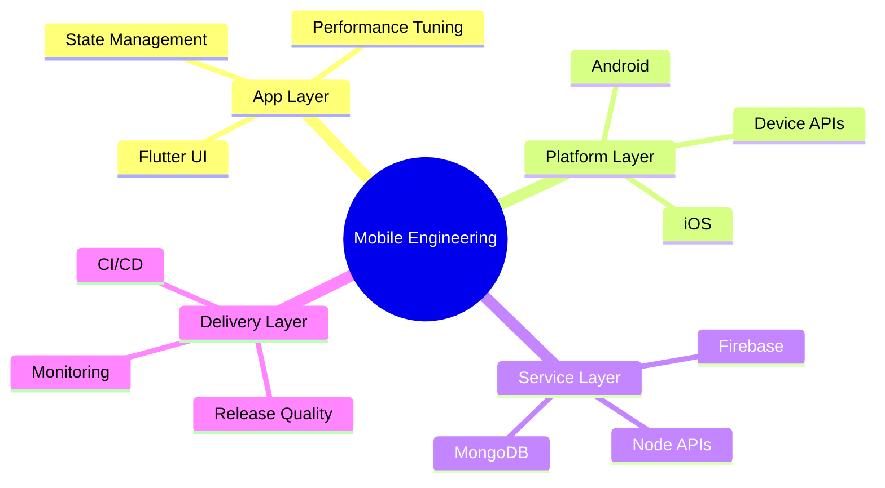

<div align="center">


[](https://git.io/typing-svg)

[](mailto:codexahmar@gmail.com)
[](https://www.linkedin.com/in/ahmaryarkhan)
[](https://twitter.com/codexahmar)
[](https://github.com/CodeXahmar)

</div>

## Field Notes

```text
name: Ahmar Yar Khan
base: Pakistan
craft: Mobile apps with Flutter
current mission: build fast, reliable products users trust
availability: open to serious product teams
```

| Signal | Value |
|---|---|
| Stack I use most | Flutter, Dart, Firebase |
| Typical features | Auth, payments, maps, notifications, realtime sync |
| What I optimize first | UX smoothness, startup time, crash-free sessions |
| Rule I don't break | Solve user pain before adding architecture layers |

## How I Work

<details>
<summary><b>01. Product first, patterns second</b></summary>

I start from the user flow and business risk, then choose architecture that earns its complexity.

</details>

<details>
<summary><b>02. Performance is a feature</b></summary>

I treat dropped frames, slow startup, and flaky networking as product bugs, not "nice to have" improvements.

</details>

<details>
<summary><b>03. Build for real operations</b></summary>

Mobile is part of a bigger system. I care about API contracts, release quality, analytics, and incident recovery.

</details>

## Signature Builds

### SafeTap
Emergency-response app where speed and reliability mattered more than visual polish.

- Role-based emergency workflows
- Live location and alert propagation
- Incident reporting with media evidence

### StripeCart
E-commerce flow designed to reduce checkout friction and failed payments.

- Stripe integration with predictable edge-case handling
- Cart and order state that survives bad networks
- Conversion-focused checkout journey

### Quran MP3 + Qibla Finder
Daily-use companion app where reliability and clarity mattered more than flashy UI.

- Streaming recitation and prayer alerts
- Compass-based Qibla direction
- Hijri calendar and multi-language support

### Face Detection App
Real-time computer vision app built around on-device responsiveness.

- ML Kit face detection pipeline
- Fast camera frame handling
- Lightweight on-device feedback loop

## Tools I Reach For

<div align="center">


</div>



## Open Dashboard

<div align="center">


[](https://git.io/streak-stats)


</div>

## Activity Feed

<!--START_SECTION:activity-->
<!--END_SECTION:activity-->

## Contribution Pulse

<div align="center">

[](https://github.com/ashutosh00710/github-readme-activity-graph)

<picture>
  <source media="(prefers-color-scheme: dark)" srcset="https://raw.githubusercontent.com/CodeXahmar/CodeXahmar/output/github-snake-dark.svg" />
  <source media="(prefers-color-scheme: light)" srcset="https://raw.githubusercontent.com/CodeXahmar/CodeXahmar/output/github-snake.svg" />
  
</picture>

</div>

## Connect

If you're building a mobile product and want engineering that balances speed with long-term maintainability, let's talk.

<div align="center">

[](mailto:codexahmar@gmail.com)
[](https://www.linkedin.com/in/ahmaryarkhan)
[](https://github.com/CodeXahmar)


</div>
