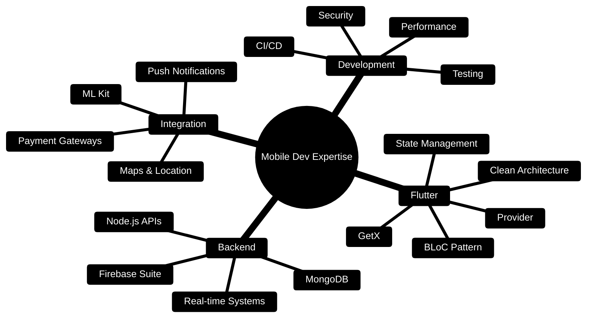

<div align="center">


[](https://git.io/typing-svg)

<br/>

[](mailto:codexahmar@gmail.com)
[](https://www.linkedin.com/in/ahmaryarkhan)
[](https://twitter.com/codexahmar)
[](https://github.com/CodeXahmar)
[](https://github.com/CodeXahmar)

<br/>


</div>

---

## `$ whoami`
```dart
class AhmarYarKhan extends FlutterEngineer {

  final String  location       = "Pakistan 🇵🇰";
  final String  role           = "Mobile App Developer";
  final String  focus          = "Scalable Production Applications";

  final List<String> strengths = [
    "Clean Architecture",
    "Real-Time Systems",
    "Firebase Integration",
    "Performance Optimization",
    "Cross-Platform Mobile Development",
  ];

  final bool    openToWork     = true;
  final String  currentStatus  = "⚡ Shipping features, not excuses.";
}
```

---

## 📊 GitHub Statistics & Achievements

<div align="center">


</div>

<div align="center">

[](https://git.io/streak-stats)

</div>

<div align="center">


</div>

---

## 🛠️ Technology Stack & Expertise

<div align="center">

### 📱 Mobile Development


### 🔥 Backend & Database


### 🛠️ Tools & Technologies


### 🎯 Core Competencies


</div>

---

## 🚀 Featured Projects Portfolio

<div align="center">

<table>
<tr>
<td width="50%" valign="top">

### 🔐 SafeTap
**Emergency Response Mobile Application**


```
✓ Role-based authentication system
✓ FCM push notifications for alerts
✓ Real-time GPS location tracking
✓ Incident reporting + media upload
✓ Offline-first architecture
```

</td>
<td width="50%" valign="top">

### 💳 StripeCart
**Full-Featured E-Commerce Application**


```
✓ Stripe payment gateway integration
✓ Cart management + order history
✓ Clean, testable architecture
✓ Smooth animated checkout UX
✓ Product catalog & search
```

</td>
</tr>
<tr>
<td width="50%" valign="top">

### 📖 Quran Mp3 + Qibla Finder
**Comprehensive Islamic Companion App**


```
✓ Full Quran audio recitations
✓ Accurate prayer time notifications
✓ Compass-based Qibla direction
✓ Hijri calendar integration
✓ Multi-language support
```

</td>
<td width="50%" valign="top">

### 🧠 Face Detection App
**ML-Powered Real-Time Vision Application**


```
✓ Google ML Kit integration
✓ Real-time face detection
✓ Emotion / expression analysis
✓ Camera stream processing
✓ High-performance rendering
```

</td>
</tr>
</table>

</div>

---

## 📈 Detailed Analytics & Insights

<div align="center">


</div>

<div align="center">


</div>

---

## 💻 Skills & Competency Matrix

<div align="center">


</div>

<br/>

<div align="center">



</div>

---

## 📅 Contribution Activity Timeline

<div align="center">

[](https://github.com/ashutosh00710/github-readme-activity-graph)

</div>

---

## ⚡ Recent GitHub Activity

<div align="center">

[](https://github.com/CodeXahmar)

<!--START_SECTION:activity-->
<!--END_SECTION:activity-->

</div>

---

## 🐍 Contribution Snake Animation

<div align="center">

<picture>
  <source media="(prefers-color-scheme: dark)" srcset="https://raw.githubusercontent.com/CodeXahmar/CodeXahmar/output/github-snake-dark.svg" />
  <source media="(prefers-color-scheme: light)" srcset="https://raw.githubusercontent.com/CodeXahmar/CodeXahmar/output/github-snake.svg" />
  
</picture>

</div>

---

<div align="center">

### 📫 Let's Connect & Build Something Amazing

[](mailto:codexahmar@gmail.com)
[](https://www.linkedin.com/in/ahmaryarkhan)
[](https://twitter.com/codexahmar)
[](https://github.com/CodeXahmar)

<br/>


---

<sub>**💡 Tip:** Check out my pinned repositories below for highlighted projects!</sub>


---

</div>
