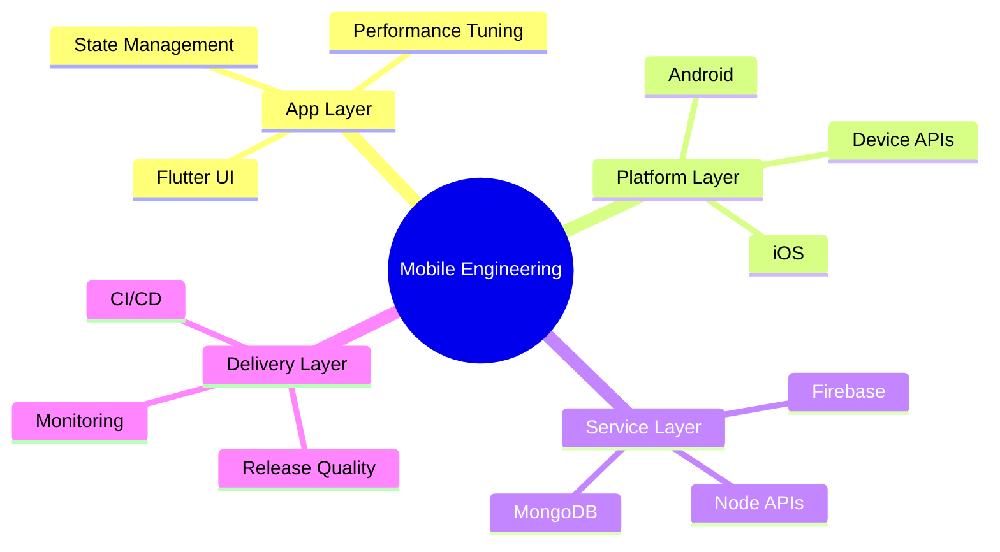

```mermaid
%%{init: {'theme':'dark', 'themeVariables': { 'primaryColor':'#161b22', 'primaryTextColor':'#ffffff', 'primaryBorderColor':'#58a6ff', 'lineColor':'#58a6ff', 'secondaryColor':'#0d1117', 'tertiaryColor':'#161b22', 'clusterBkg':'#161b22', 'clusterBorder':'#58a6ff', 'fontSize':'18px'}}}%%
graph TB
    A[Mobile Dev Expertise]
    
    A --> B[Flutter Development]
    B --> B1[Clean Architecture]
    B --> B2[State Management]
    B --> B3[BLoC Pattern]
    B --> B4[Provider]
    B --> B5[GetX]
    
    A --> C[Backend Systems]
    C --> C1[Firebase Suite]
    C --> C2[Node.js APIs]
    C --> C3[MongoDB]
    C --> C4[Real-time Systems]
    
    A --> D[Integration]
    D --> D1[Payment Gateways]
    D --> D2[Maps & Location]
    D --> D3[Push Notifications]
    D --> D4[ML Kit]
    
    A --> E[Development Practices]
    E --> E1[CI/CD]
    E --> E2[Testing]
    E --> E3[Performance]
    E --> E4[Security]
    
    style A fill:#58a6ff,stroke:#58a6ff,stroke-width:3px,color:#ffffff
    style B fill:#161b22,stroke:#58a6ff,stroke-width:2px,color:#ffffff
    style C fill:#161b22,stroke:#58a6ff,stroke-width:2px,color:#ffffff
    style D fill:#161b22,stroke:#58a6ff,stroke-width:2px,color:#ffffff
    style E fill:#161b22,stroke:#58a6ff,stroke-width:2px,color:#ffffff
    style B1 fill:#0d1117,stroke:#58a6ff,color:#ffffff
    style B2 fill:#0d1117,stroke:#58a6ff,color:#ffffff
    style B3 fill:#0d1117,stroke:#58a6ff,color:#ffffff
    style B4 fill:#0d1117,stroke:#58a6ff,color:#ffffff
    style B5 fill:#0d1117,stroke:#58a6ff,color:#ffffff
    style C1 fill:#0d1117,stroke:#58a6ff,color:#ffffff
    style C2 fill:#0d1117,stroke:#58a6ff,color:#ffffff
    style C3 fill:#0d1117,stroke:#58a6ff,color:#ffffff
    style C4 fill:#0d1117,stroke:#58a6ff,color:#ffffff
    style D1 fill:#0d1117,stroke:#58a6ff,color:#ffffff
    style D2 fill:#0d1117,stroke:#58a6ff,color:#ffffff
    style D3 fill:#0d1117,stroke:#58a6ff,color:#ffffff
    style D4 fill:#0d1117,stroke:#58a6ff,color:#ffffff
    style E1 fill:#0d1117,stroke:#58a6ff,color:#ffffff
    style E2 fill:#0d1117,stroke:#58a6ff,color:#ffffff
    style E3 fill:#0d1117,stroke:#58a6ff,color:#ffffff
    style E4 fill:#0d1117,stroke:#58a6ff,color:#ffffff
```

<div align="center">


[](https://git.io/typing-svg)

[](mailto:codexahmar@gmail.com)
[](https://www.linkedin.com/in/ahmaryarkhan)
[](https://twitter.com/codexahmar)
[](https://github.com/CodeXahmar)

</div>

---

## `$ whoami`
```dart
class AhmarYarKhan extends FlutterEngineer {

  final String  location       = "Pakistan 🇵🇰";
  final String  role           = "Mobile App Developer";
  final String  focus          = "Scalable Production Applications";

  final List<String> strengths = [
    "Clean Architecture",
    "Real-Time Systems",
    "Firebase Integration",
    "Performance Optimization",
    "Cross-Platform Mobile Development",
  ];

  final bool    openToWork     = true;
  final String  currentStatus  = "⚡ Shipping features, not excuses.";
}
```

---

## 📊 GitHub Statistics & Achievements

<div align="center">


</div>

<div align="center">

[](https://git.io/streak-stats)

</div>

<div align="center">


</div>

---

## 🛠️ Technology Stack & Expertise

<div align="center">


</div>



## Open Dashboard

<div align="center">


[](https://git.io/streak-stats)


</div>

<div align="center">


</div>

---

## 💻 Skills & Competency Matrix

<div align="center">


</div>

<br/>

<div align="center">



</div>

---

## 📅 Contribution Activity Timeline

<div align="center">

[](https://github.com/ashutosh00710/github-readme-activity-graph)

</div>

---

## ⚡ Recent GitHub Activity

<div align="center">

[](https://github.com/CodeXahmar)

<!--START_SECTION:activity-->
<!--END_SECTION:activity-->

</div>

---

## 🐍 Contribution Snake Animation

<div align="center">

[](https://github.com/ashutosh00710/github-readme-activity-graph)

<picture>
  <source media="(prefers-color-scheme: dark)" srcset="https://raw.githubusercontent.com/CodeXahmar/CodeXahmar/output/github-snake-dark.svg" />
  <source media="(prefers-color-scheme: light)" srcset="https://raw.githubusercontent.com/CodeXahmar/CodeXahmar/output/github-snake.svg" />
  
</picture>

</div>

## Connect

If you're building a mobile product and want engineering that balances speed with long-term maintainability, let's talk.

<div align="center">

[](mailto:codexahmar@gmail.com)
[](https://www.linkedin.com/in/ahmaryarkhan)
[](https://github.com/CodeXahmar)


</div>
