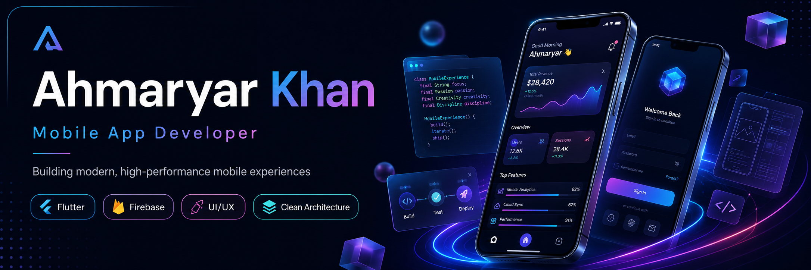
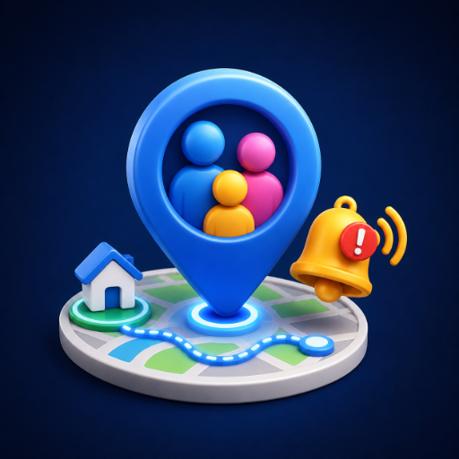

<div align="center">
  

  <br/><br/>

  <h1>Hi, I'm Ahmar Yar Khan 👋</h1>
  <p><strong>Mobile Application Engineer &bull; Flutter & Dart Specialist &bull; Full-Stack Developer</strong></p>
  <p><em>Architecting and scaling production mobile applications across diverse domains with Flutter, native integrations, and robust cloud & web backends.</em></p>

  <p>
    <a href="mailto:codexahmar@gmail.com"></a>
    <a href="https://www.linkedin.com/in/ahmaryarkhan" target="_blank"></a>
    <a href="https://www.instagram.com/codexahmar" target="_blank"></a>
    <a href="https://github.com/codexahmar"></a>
  </p>

  <p>
    <code>3+ Years Experience</code> &bull;
    <code>Flutter & Dart</code> &bull;
    <code>Android & iOS</code> &bull;
    <code>Clean Architecture</code> &bull;
    <code>Firebase & Supabase</code> &bull;
    <code>MERN Stack</code>
  </p>
</div>

<br/>

---

### 🧑‍💻 About Me

```yaml
name: Ahmar Yar Khan
role: Mobile Application Engineer (Flutter/Dart) & Full-Stack Developer
experience: 3+ Years Professional Development

core_strengths:
  architecture_state_management:
    - Clean Architecture, Feature-Based Modular Structure, SOLID
    - BLoC, Riverpod, Provider, GetX
  mobile_native:
    - Flutter & Dart (Cross-Platform Mobile Development)
    - Native Android & iOS Integrations (Platform Channels)
    - Background Services, Push Notifications, Deep Linking
  telemetry_realtime:
    - Live Geolocation Tracking, Polygon Geofencing, Location Sharing
    - Driver/Rider Workflows & WebSocket / Firestore Real-Time Data Sync
  backend_cloud:
    - Firebase (Auth, Firestore, Cloud Functions, FCM, Cloud Storage) & Supabase
    - Node.js, Express.js, MongoDB & RESTful APIs
  web_fullstack:
    - React, Tailwind CSS, Responsive Web & Admin Dashboards
  services_integrations:
    - Payment Gateways (Stripe, In-App Purchases), Google Maps APIs
    - Gemini AI, AdMob, Google Sign-In, OTP & Third-Party Services
  product_engineering:
    - Google Play Store & Apple App Store Publishing & ASO
    - Offline-First Architecture, Localization (i18n), Performance Profiling, CI/CD

passions: Building reliable, user-focused applications that combine thoughtful architecture, practical functionality, and polished user experiences
```

<br/>

---

### 🛠️ Tech Stack & Tooling

- **Mobile Development:**  
  
  
  
  
  
  

- **Frontend & Web:**  
  
  
  
  
  

- **Backend, Cloud & Databases:**  
  
  
  
  
  
  

- **Developer Tools & Environment:**  
  
  
  
  
  
  

---

### 🚀 Featured Projects

<table width="100%" style="border-collapse: collapse;">
  <tr>
    <td width="50%" valign="top" style="padding: 16px;">
      <h3 align="left">
        
        Locafii: Family GPS Tracker
      </h3>
      <p><strong>Real-Time Family & Group Location Tracking</strong> &bull; <code>Published App</code></p>
      <p><em>Location-based safety platform for live group tracking, places management, and perimeter alerts.</em></p>
      <p>
        <a href="https://play.google.com/store/apps/details?id=com.codexahmar.locafii" target="_blank"></a>
        
        
      </p>
      <ul>
        <li>Real-time multi-user location sharing and live tracking with Firebase</li>
        <li>Continuous background location service with battery-conscious updates</li>
        <li>Place-based geofencing triggers with instant entry and exit alerts</li>
        <li>Group invitations, circle management, and live device battery status</li>
      </ul>
    </td>
    <td width="50%" valign="top" style="padding: 16px;">
      <h3 align="left">
        
        Islam Plus: Quran, Azan, Qibla
      </h3>
      <p><strong>Quran, Prayer & Islamic Companion</strong> &bull; <code>Published App</code></p>
      <p><em>Multi-language Islamic suite integrating Quran, Hadith, prayer tools, and daily spiritual features.</em></p>
      <p>
        <a href="https://play.google.com/store/apps/details?id=com.codexahmar.islamplus" target="_blank"></a>
        
        
        
      </p>
      <ul>
        <li>Quran reader with translations, audio recitations, bookmarks, and offline mode</li>
        <li>Prayer times calculation, Qibla compass, Azkar, Tasbeeh, and Hadith references</li>
        <li>Background prayer push notifications with customizable alert schedules</li>
        <li>AI Islamic Assistant with multi-language conversation support</li>
      </ul>
    </td>
  </tr>
  <tr>
    <td width="50%" valign="top" style="padding: 16px;">
      <h3 align="left">
        
        Study Buddy: AI Study Planner
      </h3>
      <p><strong>AI Study Planner & Learning Assistant</strong> &bull; <code>Published App</code></p>
      <p><em>AI study companion transforming courses, exams, and milestones into structured daily plans.</em></p>
      <p>
        <a href="https://play.google.com/store/apps/details?id=com.codexahmar.studybuddy" target="_blank"></a>
        
        
        
      </p>
      <ul>
        <li>AI-generated schedules tailored by course syllabus, exam dates, and capacity</li>
        <li>Automated flashcard and quiz generator for active recall and self-testing</li>
        <li>Interactive AI Tutor supporting contextual academic questions and voice input</li>
        <li>Exam countdowns, syllabus progress tracking, notes, and study analytics</li>
      </ul>
    </td>
    <td width="50%" valign="top" style="padding: 16px;">
      <h3 align="left">
        
        Mishwarak
      </h3>
      <p><strong>Ride-Hailing & Dispatch Platform</strong> &bull; <code>Client Project</code></p>
      <p><em>Ride-hailing platform architected with rider, driver, and admin dispatch workflows.</em></p>
      <p>
        
        
        
      </p>
      <ul>
        <li>Dedicated rider and driver apps with location-based pickup matching</li>
        <li>Radius-expansion driver discovery and real-time ride status lifecycle</li>
        <li>Secure OTP phone authentication, interactive maps, and live trip tracking</li>
        <li>Supabase-powered real-time backend with centralized administrative dashboard</li>
      </ul>
    </td>
  </tr>
  <tr>
    <td width="50%" valign="top" style="padding: 16px;">
      <h3 align="left">
        
        Chor Police: Party Game
      </h3>
      <p><strong>Multiplayer Social Deduction Game</strong> &bull; <code>Published App</code></p>
      <p><em>Real-time multiplayer mobile game centered on secret role distribution and synchronized state.</em></p>
      <p>
        <a href="https://play.google.com/store/apps/details?id=com.codexahmar.chorpolice" target="_blank"></a>
        
        
        
      </p>
      <ul>
        <li>Real-time multiplayer lobbies with live room code generation and player sync</li>
        <li>Dynamic secret role distribution, voting rounds, turn timers, and win conditions</li>
        <li>Synchronized client-server state handling via WebSocket event pipelines</li>
        <li>Responsive game layout with fluid turn-based UI transitions</li>
      </ul>
    </td>
    <td width="50%" valign="top" style="padding: 16px;">
      <h3 align="left">
        🛡️ Emergency SOS & Safety Dispatch
      </h3>
      <p><strong>Personal Safety & Emergency Broadcast</strong> &bull; <code>Mobile App</code></p>
      <p><em>Safety application built for instant distress broadcasting and emergency location sharing.</em></p>
      <p>
        
        
        
      </p>
      <ul>
        <li>One-tap panic trigger dispatching immediate coordinates to emergency contacts</li>
        <li>Location-based emergency contact dispatch and interactive map display</li>
        <li>Continuous background GPS tracking during active SOS alert states</li>
        <li>Streamlined workflow designed for low-stress, rapid operation in emergencies</li>
      </ul>
    </td>
  </tr>
</table>


<br/>

---

### 📊 GitHub Activity

<div align="center">
  <table width="100%" style="border-collapse: collapse;">
    <tr>
      <td align="center" style="padding: 20px; background: transparent;">
        <picture>
          <source media="(prefers-color-scheme: dark)" srcset="https://raw.githubusercontent.com/codexahmar/CodeXahmar/output/github-snake-dark.svg" />
          <source media="(prefers-color-scheme: light)" srcset="https://raw.githubusercontent.com/codexahmar/CodeXahmar/output/github-snake.svg" />
          
        </picture>
      </td>
    </tr>
  </table>
</div>

---

### 💡 Daily Engineering Thought

<div align="center">
  
</div>

<br/>

---

### 📬 Let's Connect & Collaborate

<div align="center">
  <h3>Have an ambitious mobile app idea or need a scalable full-stack system built?</h3>
  <p><em>I am open to high-impact mobile development roles, freelance builds, and technical consultations.</em></p>
  
  <p>
    <a href="mailto:codexahmar@gmail.com"></a>
    <a href="https://www.linkedin.com/in/ahmaryarkhan" target="_blank"></a>
  </p>
</div>
